```{r setup, include = FALSE, echo=FALSE, results = 'asis'}
knitr::opts_chunk$set(
  collapse = TRUE,
  comment = "#>"
)
BiocStyle::markdown()
```

# Introduction

```{r, echo = FALSE, out.width = "35%", out.height = "35%", fig.align = "left"}
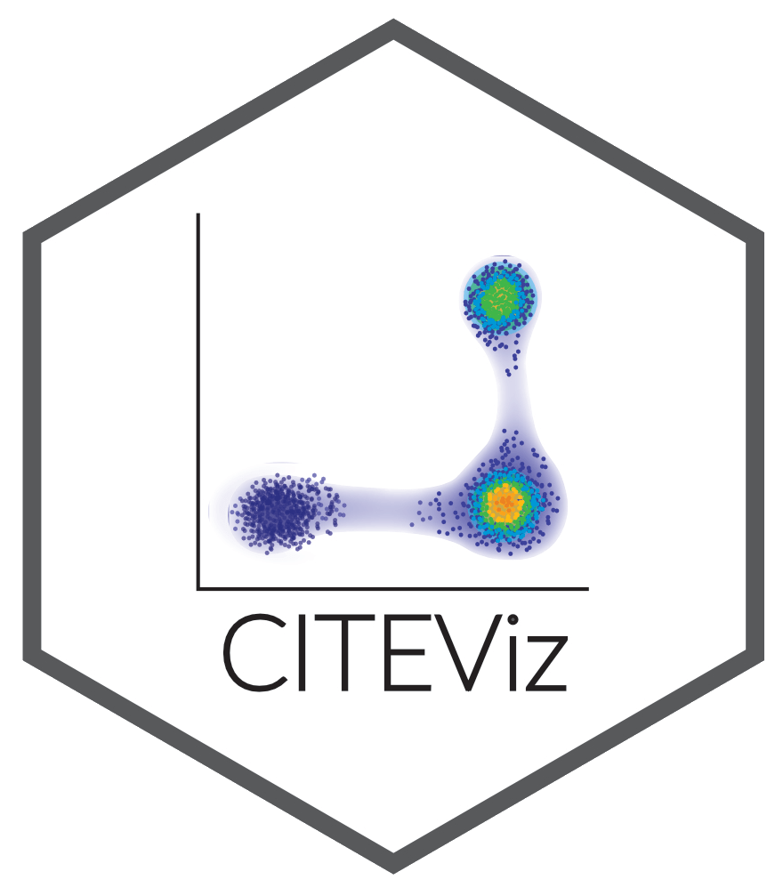
```

```CITEViz``` (pronounced "sight-viz") is a single-cell visualization platform with a custom module that replicates the flow-cytometry gating workflow. In real time, users can iteratively subset cell populations of interest using the unique surface proteins, and see those cells reflected in the original dimension reduction (e.g. PCA, tSNE, UMAP) space (forward-gate). Users can also highlight cells in dimensional reduction (DR) space and quickly locate them in a 2D gate window via back-gating. Additionally, CITEViz provides interactive quality control (QC) plots and 2D multi-omic feature expression plots. This vignette demonstrates the usage of CITEViz on a subset of CITE-seq data from peripheral blood mononuclear cells (PBMC) by [Hao et. al. 2021](https://doi.org/10.1016/j.cell.2021.04.048).

## Installation

Make sure you have R version **4.2.0** or later installed. We recommend installing CITEViz through the RStudio IDE using the following commands:

```{r eval=FALSE}
if (!require("BiocManager", quietly = TRUE))
    install.packages("BiocManager")

BiocManager::install("CITEViz")
```

## Running CITEViz

To run CITEViz, use the following commands:

```{r eval=FALSE}
# load package
library(CITEViz)

# run CITEViz
run_app()
```


## Data Input Format

CITEViz accepts files in the RDS (.rds) format. The preferred RDS file should include a [Seurat](https://satijalab.org/seurat/) object or a [SingleCellExperiment](https://bioconductor.org/packages/release/bioc/html/SingleCellExperiment.html) object. If a list of a single Seurat object is used, only the object labeled "integrated" will be used. 

**Sample data:** In this vignette, we used a 10K cell down-sample of the PBMC dataset from [Hao et. al. 2021](https://doi.org/10.1016/j.cell.2021.04.048). The sample PBMC dataset (`small_pbmc.rds`) for this vignette can be downloaded from Google Drive [here](https://drive.google.com/drive/folders/1rdXWVMkAshsEM9C-xtixLMsRO4AK3Lgf).

**Getting started:** After calling `run_app()` to start CITEViz, a file can be uploaded using the file upload box at the top of any page in CITEViz. After clicking the file upload box, a file explorer window containing files in the user's local filesystem will open. The user can select an RDS file containing CITE-seq data to upload, and the same dataset will be retained for exploration across all tabs. 


## Data Export

CITEViz uses interactive data visualization and exploration packages such as [Plotly](https://plotly-r.com/) and [DT](https://rstudio.github.io/DT/). `Plotly` plots can be exported as PNG files, and `DT` datatables can be copied, printed, or exported as files for downstream analysis. 

After gating for cell populations of interest (see [Gating][Gating] section of this vignette), the metadata for each gate is saved in an internal Gate object. These metadata include cell barcodes that can facilitate downstream analysis such as differential gene expression (see [Downstream Analysis][Downstream Analysis] section of this vignette). To download this gating data as a list of gates in RDS format, the user can click the "List (.rds)" button at the bottom of the gating page.


# Quality Control

The first step of analysis is to assess the quality of sequencing data. Here we provide QC plots that display data for common metrics such as gene or antibody-derived tag (ADT) counts per assay, number of unique ADTs, and mitochondrial expression, which can be visualized by any categorical metadata in the user’s Seurat or SingleCellExperiment object. Dotted lines in each QC plot represent the values at which 50%, 75%, and 95% of the data falls at or below that value.

```{r, echo = FALSE, out.width = "100%", out.height = "125%", fig.align="center"}
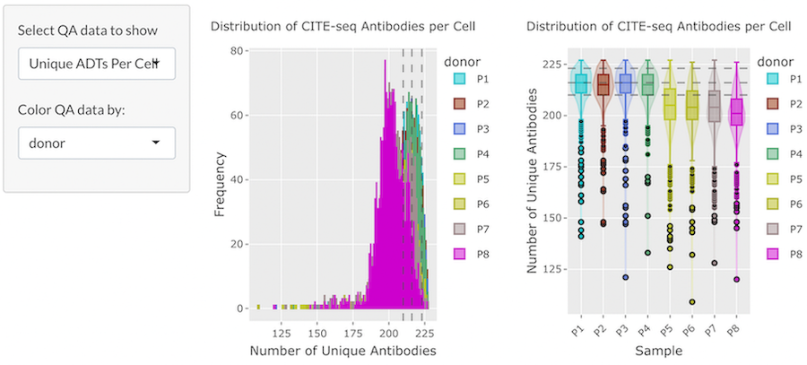
```

# Clustering 

The Clustering page allows the user to view cell clusters in two- and three-dimensional space. These clusters can be colored by any categorical metadata, and the user can select dimensionality reductions (e.g., UMAP, PCA, etc.) to view from a dropdown menu. 

```{r, echo = FALSE, out.width = "100%", out.height = "125%", fig.align="center"}
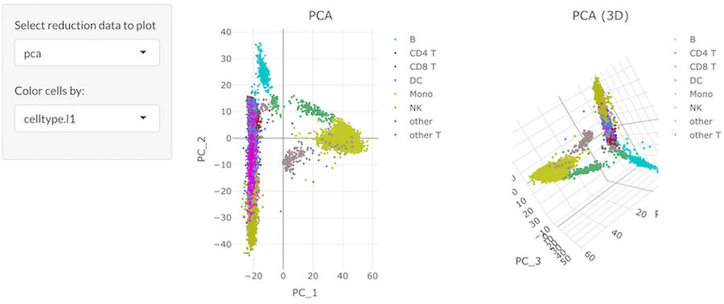
```

When the user’s cursor hovers over the 2D reduction plot, a [Plotly](https://plotly-r.com/) toolbox with labeled options will appear. From this toolbox, the user can zoom, pan, download, and reset a plot by selecting an option. The user can also use the box or lasso selection tool to select specific cells in a plot. The metadata for selected cells appears in the scrollable, interactive data table below the plots, and the user can print or copy this data to their clipboard.

```{r, echo = FALSE, out.width = "70%", fig.align="center"}
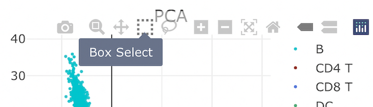
```


# Feature Expression

CITEViz supports RNA and ADT feature expression visualizations in both one-dimensional and two-dimensional formats. On the feature expression tabs of CITEViz, cell clusters are displayed in a dimensional reduction plot. These cell clusters can be colored by expression levels of selected RNA and/or ADT features. Similar to the clustering page, the user can select the type of dimensional reduction to view.


## One-Dimensional (1D) Feature Expression

In 1D feature expression, cells in a dimensional reduction plot are colored by expression levels for one RNA or ADT feature. The user can select a specific RNA or ADT feature from a dropdown menu.

```{r, echo = FALSE, out.width = "100%", out.height = "125%", fig.align="center"}
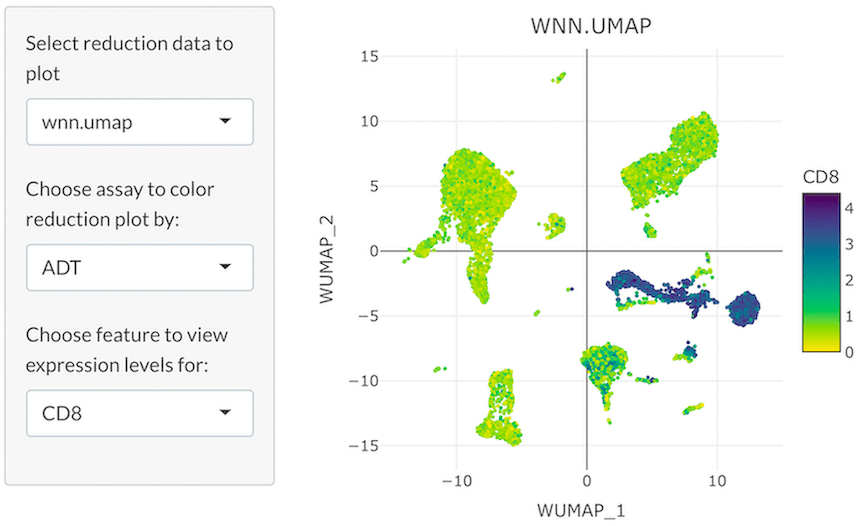
```

## Two-Dimensional (2D) Feature Expression

Co-expression of features greatly facilitates a holistic view of single-cell multi-omic datasets. In 2D feature expression, cells in a dimensional reduction plot are colored by expression levels for two gene and/or ADT features simultaneously. The user can select specific gene and/or ADT features from dropdown menus. CITEViz can visualize co-expression of features from the same assay (i.e. two genes or two ADTs), as shown below, or two features from different assays (i.e. one gene and one ADT).

```{r, echo = FALSE, out.width = "100%", out.height = "125%", fig.align="center"}
# knitr::include_graphics("feature_expression_color_matrix.png")

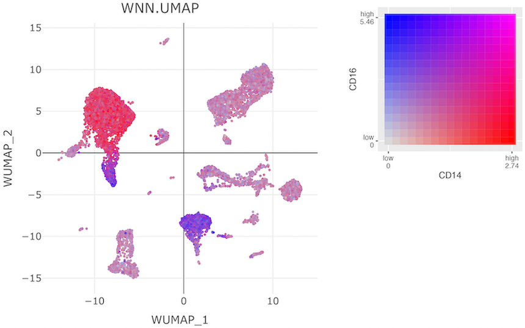
```


# Gating 

## Forward Gating

A key feature of CITEViz is that users can iteratively gate (subset) cells using antibody markers, and the selected cells are immediately highlighted in the dimensional reduction space (e.g. UMAP, PCA, tSNE, etc.). Users can subset cells using one or more gates to explore specific cell populations similar to flow cytometry.

### General Workflow

1. **Select plot settings:** From dropdown menus in the sidebar panel, the user can select an assay (e.g. ADT) and two assay features (e.g. CD4, CD8) for which to plot normalized expression levels. The user can also select a reduction (e.g. UMAP) for which to plot dimensional reduction embeddings, and can color the cells in the reduction plot by a discrete metadata category (e.g. celltype).
2. **Select cells:** When the user’s cursor hovers over each plot on the gating page, a [Plotly](https://plotly-r.com/) toolbox with labeled options will appear. From this toolbox, the user can choose a cell selection tool, zoom, pan, download, or reset a plot by selecting an option. The user can use the box or lasso selection tool to select specific cells in the feature scatter plot. When cells in the feature scatter plot are selected, the corresponding cells in the reduction plot will be highlighted.
3. **Label the selected cells:** To input a name for a subset of cells to be gated, use the text-input field of the sidebar panel prior to clicking the gate button. 
4. **Click the gate button:** After gating a subset of cells, information about the newly-created gate will be displayed in a scrollable, interactive data table below the plots.

### Additional Features

* Users can click on previous gates from the data table to view the feature scatter plot of that cell population. Using this feature, users can also revert back to a previously created gate for further subsetting and gating. 
* To permanently delete all gating information in the data table, click the "Clear All Data" button.
* To rename the selected cell subset after gating, double-click in the corresponding Subset_Name area of the data table, type a new name, then press the Tab key or click outside of the table.

```{r, echo = FALSE, out.width = "100%", fig.align="center"}
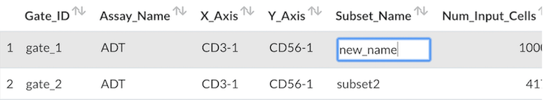
```

* To reset the feature scatter plot and view the entire input cell population, click the "Reset Scatter" button.
* To view detailed gating data, users can download this data in a variety of formats listed at the bottom of the gating page.
* To reset the colors of the cells in the reduction plot, double-click anywhere in the feature scatter plot.


### Example

In the following example, we demonstrate a 2-layer gate to isolate cells with specific levels of CD11b-1 and CD45-1 (mixture of myeloid and lymphoid cells) from the whole cell population, followed by the isolation of CD8+ CD4- cells from this first subset to view the CD8+ T-cell subpopulation:

1. Select cells with relatively low levels of CD11b-1 and CD45-1.

```{r, echo = FALSE, out.width = "100%", out.height = "125%", fig.align="center"}
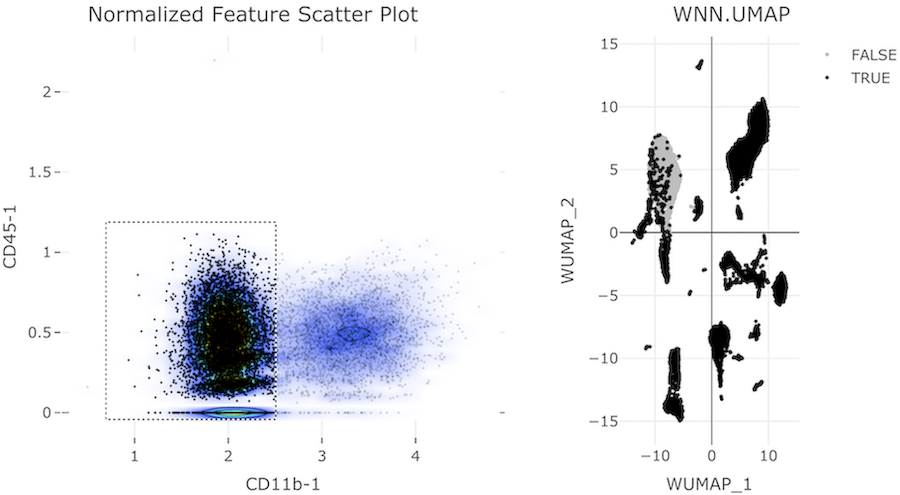
```

2. From the cells in the first gate, select cells with low levels of CD4 and high levels of CD8.

```{r, echo = FALSE, out.width = "100%", out.height = "125%", fig.align="center"}
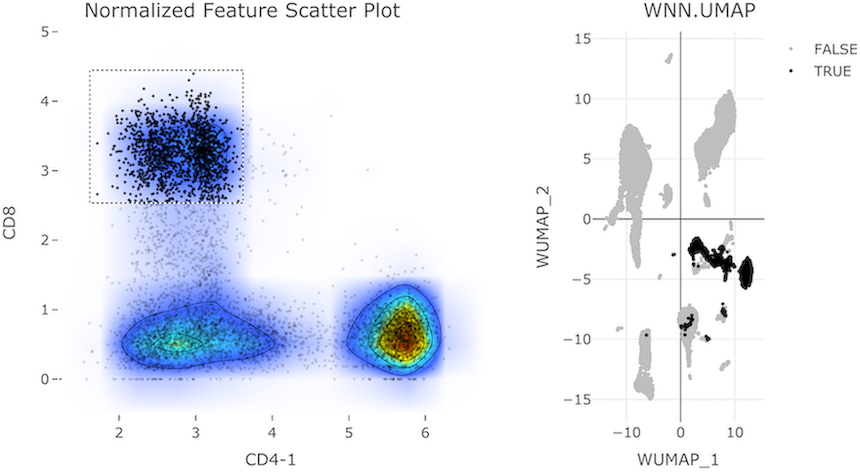
```


## Back-Gating

Users can back-gate on a selection of cells in a reduction plot and highlight them in feature space. On the back-gating page, users can highlight cells in feature space from a “labels-first” or “top-down” workflow. For example, users can select a range of cells from the reduction plot (e.g. UMAP, PCA etc.) and locate them in the feature scatter plot for more extensive data exploration. 

### General Workflow

Plot settings, cell population selection and naming methods are analogous to the gating page. To reset the colors of the cells in the feature scatter plot, double-click anywhere in the reduction plot.

### Example

In the following example, we back-gate on a selection of B-cells in the WNN.UMAP reduction plot. These selected cells are then highlighted in black in the feature scatter plot.

```{r, echo = FALSE, out.width = "100%", out.height = "125%", fig.align="center"}
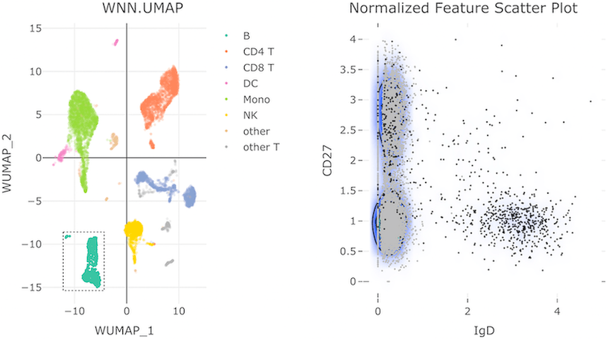
```


# Downstream Analysis

## Differential Expression Analysis Between Two Cell Populations

CITEViz gates contain a rich resource of metadata that can facilitate further downstream analyses. For a runnable example of downstream analysis, consider looking through the [CITEViz BioConductor Workshop 2022](https://github.com/gartician/CITEVizWorkshop).

In the tutorial below, B-cell and NK-cell clusters are isolated in CITEViz, then re-imported into [Seurat](https://satijalab.org/seurat/) for differential expression analysis.


**1. B-Cell Gating Scheme**

To isolate B-cells, we can plot the whole cell population along the IgD (x-axis) and CD27 (y-axis) features from the ADT assay. Then, we can use the box-selection tool to subset the cells expressing IgD on the right side of the feature scatter plot:

```{r, echo = FALSE, out.width = "100%", out.height = "125%", fig.align="center"}

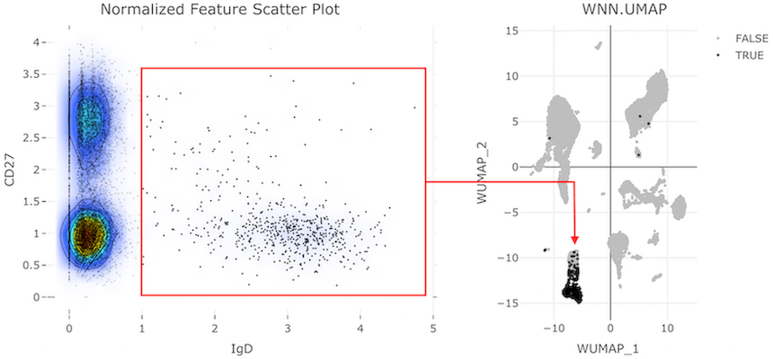
```

To download the gating data, click the "List (.rds)" button at the bottom of the gating page. Here, we saved the B-cell gating data in a custom file named `B-cells.rds`. 

**2. NK-Cell Gating Scheme**

Once B-cells are isolated, the user can click the "Reset Scatter" button to to display the entire cell population in the feature scatter plot again. To isolate NK-cells, we can plot the whole cell population along the CD3-1 (x-axis) and CD56-1 (y-axis) features. Then, we can use the box-selection tool to subset the cells that are CD3-negative and CD56-positive in the upper left corner of the feature scatter plot:

```{r, echo = FALSE, out.width = "100%", out.height = "125%", fig.align="center"}
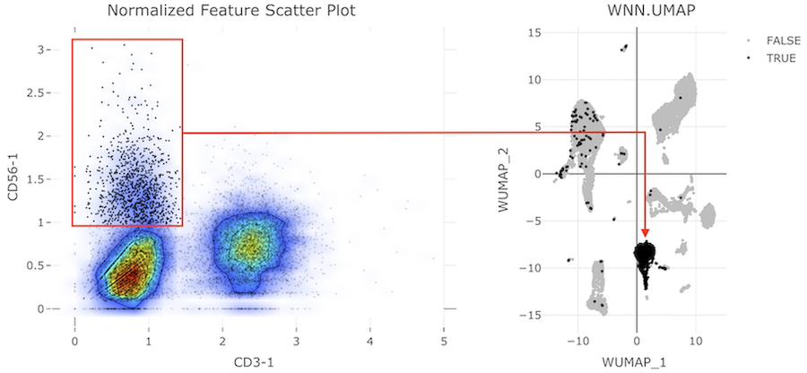
```

To download the gating data, click the "List (.rds)" button at the bottom of the gating page. Here, we saved the NK-cell gating data in a custom file named `NK-cells.rds`. 

**3. Differential Expression in Seurat**

Once two cell populations of interest are isolated, the gating data can be read back into Seurat to facilitate differential expression as follows:

```{r eval=FALSE}
library(Seurat)

# import test data
pbmc_small <- readRDS("small_pbmc.rds")

# import gates defined in CITEViz
b_gate <- readRDS("B-cells.rds")
nk_gate <- readRDS("NK-cells.rds")

# extract cell barcodes in each gate
b_barcodes <- b_cells$gate_1@subset_cells[[1]]
nk_barcodes <- nk_gate$gate_1@subset_cells[[1]]

# preview some cell barcodes in each gate
head(b_barcodes)
head(nk_barcodes)
```

Sample cell barcodes in each gate:

```
[1] "L4_TCTTTGAAGAAGCTCG"   "L2_CAGGGCTGTTACCGTA"   "E2L4_GGGTGAATCAGGACGA" "L1_GAGTCTAAGGTCTACT"  
[5] "E2L6_AGGTAGGCACGGCCAT" "L2_TCAGCCTTCTCTGCCA"  
[1] "L4_TTGCTGCCACGCTGTG"   "L3_ATTTCTGCAGTGCGCT"   "E2L4_TGGTAGTTCGCCAATA" "E2L3_ATCAGGTGTTTGGCTA"
[5] "E2L2_TTTGATCAGCCATTCA" "E2L7_GTTCTATTCGTACCTC"
```

```{r eval=FALSE}
# ensure different cell barcodes in both gates
b_barcodes <- setdiff(b_barcodes, nk_barcodes)

# prepare differential expression
diff_exp <- FindMarkers(pbmc_small, ident.1 = b_barcodes, ident.2 = nk_barcodes)

# view differential expression results
View(diff_exp)
```

Sample differential expression results:

|           | p_val     | avg_log2FC | pct.1 | pct.2 | p_val_adj  |
|-----------|-----------|------------|-------|-------|------------|
| MS4A1     | 3.07e-279 |     3.17        | 0.983 | 0.03  | 6.38e-275 |
| CD79A     | 1.99e-278 |     2.96        | 0.978 | 0.02  | 4.14e-274  |
| IGHD      | 1.29e-272 |     3.22        | 0.957 | 0.01  | 2.67e-268 |
| IGHM      | 9.57e-266 |     2.50      | 0.985 | 0.08  | 1.98e-261 |
| BANK1     | 1.21e-258 |     2.29      | 0.93  | 0.01  | 2.50e-254 |
| RALGPS2   | 2.69e-244 |     2.34      | 0.942 | 0.07  | 5.59e-240 |
| CD79B     | 1.50e-222 |     2.17      | 0.949 | 0.16  | 3.12e-218 |
| TYROBP    | 8.83e-219 |     2.51      | 0.28  | 0.98  | 1.83e-214 |
| LINC00926 | 1.21e-216 |     1.65      | 0.828 | 0.02  | 2.51e-212 |


# Session Info

```{r}
sessionInfo()
```
