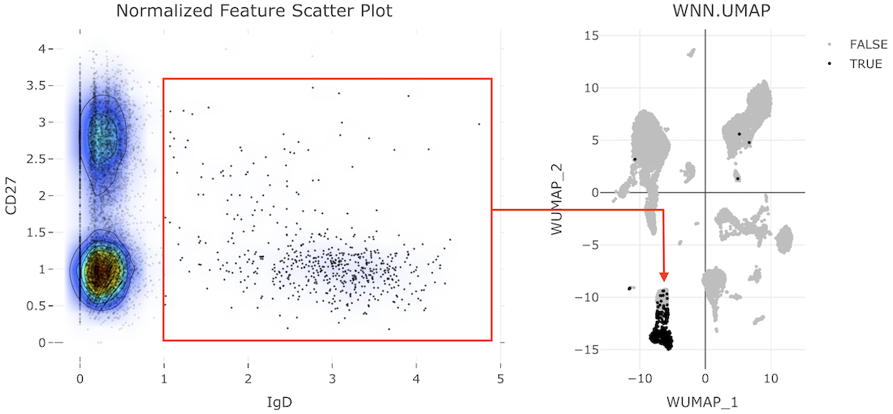
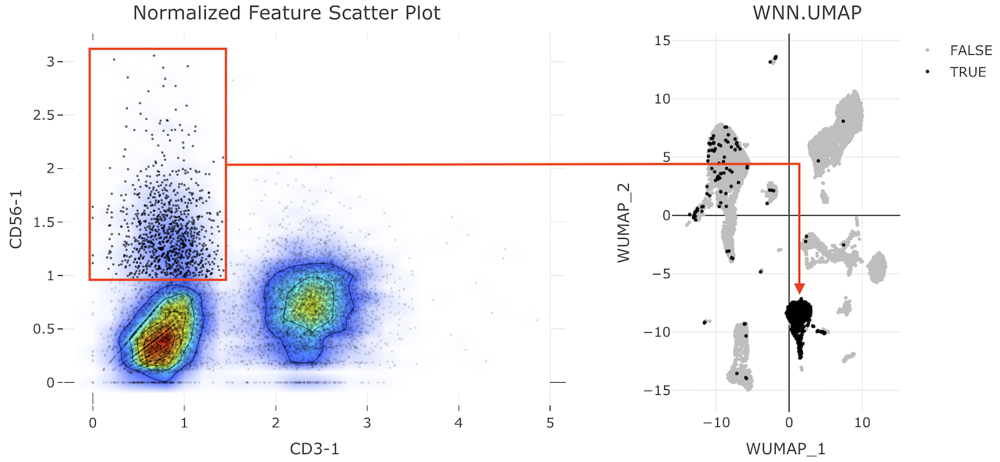

```{r setup, include = FALSE, echo=FALSE, results = 'asis'}
knitr::opts_chunk$set(
  collapse = TRUE,
  comment = "#>"
)

BiocStyle::markdown()
```

# Introduction and Setup

```CITEViz``` (pronounced "sight-viz") is a single-cell visualization platform 
with a custom module that replicates the flow-cytometry gating workflow. 
In real time, users can iteratively subset cell populations of interest using 
the unique surface proteins, and see those cells reflected in the original 
dimension reduction (e.g. PCA, tSNE, UMAP) space (forward-gate). 
Users can also highlight cells in dimensional reduction (DR) space and 
quickly locate them in a 2D gate window via back-gating. 
Additionally, CITEViz provides interactive quality control (QC) plots and 2D 
multi-omic feature expression plots. This vignette demonstrates 
the usage of CITEViz on a subset of CITE-seq data from peripheral blood 
mononuclear cells by 
[Hao et. al. 2021](https://doi.org/10.1016/j.cell.2021.04.048).

## Installation

Make sure you have R version **4.1.0** or later installed. We recommend installing CITEViz through the RStudio IDE using the following commands:

```{r eval=FALSE}
devtools::install_github("maxsonBraunLab/CITEViz")
library(CITEViz)
run_app()
```

CITEViz will be uploaded to Bioconductor version 3.16, and the release date is currently set for October 2022. 

## Data Upload

CITEViz accepts files in the RDS (.rds) format. Files should include a Seurat object or list of Seurat objects, with each object representing an experimental sample or treatment condition. Alternatively, a single Seurat object containing data integrated from all treatment conditions (an “integrated” object) can be used. A file can be uploaded using the depicted file upload box at the top of any page in CITEViz, and the same dataset will be retained for exploration across all tabs.


# Quality Control (QC) Visualization 

The first step of analysis is to assess the quality of sequencing data. Here we provide QC plots that display data for common metrics such as gene or antibody-derived tag (ADT) counts per assay, number of unique ADTs, and mitochondrial expression, which can be visualized by any categorical metadata in the user’s Seurat object.


# Clustering 

The Clustering page allows the user to view cell clusters in two- and three-dimensional space. These clusters can be colored by any categorical metadata, and the user can select dimensionality reductions (e.g., UMAP, PCA, etc.) to view from a dropdown menu. When the user’s cursor hovers over the 2D reduction plot, a plot toolbox with labeled options will appear. From this toolbox, the user can zoom, pan, download, and reset a plot by selecting an option. The user can also use the box or lasso selection tool to select specific cells in a plot. The metadata for selected cells appears in the data table below the plots, and the user can print or copy this data to their clipboard.


# Feature Expression 

CITEViz supports RNA and ADT feature expression visualizations in both one-dimensional and two-dimensional formats. On the feature expression tabs of CITEViz, cell clusters are displayed in a dimensional reduction plot. These cell clusters can be colored by expression levels of selected RNA and/or ADT features. Similar to the clustering page, the user can select the type of dimensional reduction to view.


## One-Dimensional (1D) Feature Expression

In 1D feature expression, cells in a dimensional reduction plot are colored by expression levels for one RNA or ADT feature. The user can select a specific RNA or ADT feature from a dropdown menu.


## Two-Dimensional (2D) Feature Expression

Co-expression of features greatly facilitates a holistic view of single-cell multi-omic datasets. In 2D feature expression, cells in a dimensional reduction plot are colored by expression levels for two gene and/or ADT features simultaneously. The user can select specific gene and/or ADT features from dropdown menus. CITEViz can visualize co-expression of features from the same assay (i.e. two genes or two ADTs) or two features from different assays, as shown below (i.e. one gene and one ADT).


# Gating 

## Forward Gating

A key feature of CITEViz is that users can sequentially gate (subset) cells in the dimensional reduction space (e.g. UMAP, PCA, tSNE, etc.) based on a desired set of features (ADTs, genes, etc.). Users can use one or multiple layers of gates to explore specific cell populations in a process similar to flow cytometry. In the following example, we demonstrate a 2-layer gate to isolate cells with specific levels of CD11b-1 and CD45-1 (mixture of myeloid and lymphoid cells) from the whole cell population, followed by the isolation of CD8+ CD4- cells from this first gate to view the CD8+ T-cell subpopulation:

{width=120%}

## Back-Gating

Users can back-gate on a selection of cells and highlight them in feature space. On the back-gating page, users can highlight cells in feature space from a “labels-first” or “top-down” workflow. In the following example, we back-gate on a selection of B-cells:


# Downstream Analysis

## Differential Expression Analysis Between Two Cell Populations

CITEViz gates contain a rich resource of metadata that can facilitate further downstream analyses. In the tutorial below, B-cell and NK-cell clusters are isolated in CITEViz, then re-imported into Seurat for differential expression analysis.

<br>

**1. B-Cell Gating Scheme**

To isolate B-cells, we can plot the whole cell population along the IgD (x-axis) and CD27 (y-axis) features. Then, we can use the box-selection tool to subset the cells expressing IgD on the right side of the feature scatter plot:



To download the gating data, click the "List (.rds)" button at the bottom of the gating page. Here, we saved the B-cell gating data in a custom file named `B-cells.rds`. 

<br>

**2. NK-Cell Gating Scheme**

Once B-cells are isolated, the user can click the "Reset Scatter" button to to display the entire cell population in the feature scatter plot again. To isolate NK-cells, we can plot the whole cell population along the CD3-1 (x-axis) and CD56-1 (y-axis) features. Then, we can use the box-selection tool to subset the cells that are CD3-negative and CD56-positive in the upper left corner of the feature scatter plot:



To download the gating data, click the "List (.rds)" button at the bottom of the gating page. Here, we saved the NK-cell gating data in a custom file named `NK-cells.rds`. 

<br>

**3. Differential Expression in Seurat**

Once two cell populations of interest are isolated, the gating data can be read back into Seurat to facilitate differential expression as follows:

```{r eval=FALSE}
library(Seurat)

# import original data
pbmc_small <- readRDS("small_pbmc.rds")

# import gates defined in CITEViz
b_gate <- readRDS("B-cells.rds")
nk_gate <- readRDS("NK-cells.rds")

# extract cell barcodes in each gate
b_barcodes <- b_cells$gate_1@subset_cells[[1]]
nk_barcodes <- nk_gate$gate_1@subset_cells[[1]]

# preview some cell barcodes in each gate
head(b_barcodes)
head(nk_barcodes)
```

Sample cell barcodes in each gate:

```
[1] "L4_TCTTTGAAGAAGCTCG"   "L2_CAGGGCTGTTACCGTA"   "E2L4_GGGTGAATCAGGACGA" "L1_GAGTCTAAGGTCTACT"  
[5] "E2L6_AGGTAGGCACGGCCAT" "L2_TCAGCCTTCTCTGCCA"  

[1] "L4_TTGCTGCCACGCTGTG"   "L3_ATTTCTGCAGTGCGCT"   "E2L4_TGGTAGTTCGCCAATA" "E2L3_ATCAGGTGTTTGGCTA"
[5] "E2L2_TTTGATCAGCCATTCA" "E2L7_GTTCTATTCGTACCTC"
```

```{r eval=FALSE}
# ensure different cell barcodes in both gates
b_barcodes <- setdiff(b_barcodes, nk_barcodes)

# prepare differential expression
diff_exp <- FindMarkers(pbmc_small, ident.1 = b_barcodes, ident.2 = nk_barcodes)

# view differential expression results
View(diff_exp)
```

|           | p_val                 | avg_log2FC | pct.1 | pct.2 | p_val_adj             |
|-----------|-----------------------|------------|-------|-------|-----------------------|
| MS4A1     | 3.07e-279 | 3.17       | 0.983 | 0.03  | 6.38e-275 |
| CD79A     | 1.99e-278 | 2.96       | 0.978 | 0.02  | 4.14e-274  |
| IGHD      | 1.29e-272  | 3.22       | 0.957 | 0.01  | 2.67e-268 |
| IGHM      | 9.57e-266 | 2.50       | 0.985 | 0.08  | 1.98e-261 |
| BANK1     | 1.21e-258 | 2.29       | 0.93  | 0.01  | 2.50e-254 |
| RALGPS2   | 2.69e-244 | 2.34       | 0.942 | 0.07  | 5.59e-240 |
| CD79B     | 1.50e-222 | 2.17       | 0.949 | 0.16  | 3.12e-218 |
| TYROBP    | 8.83e-219 | 2.51       | 0.28  | 0.98  | 1.83e-214 |
| LINC00926 | 1.21e-216 | 1.65       | 0.828 | 0.02  | 2.51e-212 |

```{r}
sessionInfo()
```
